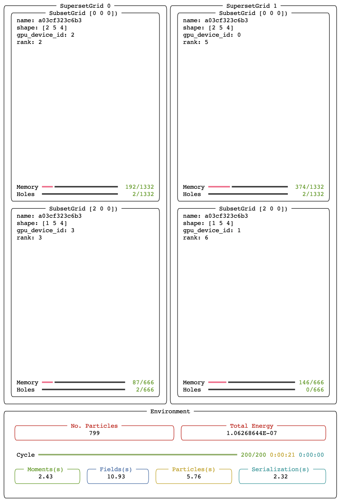
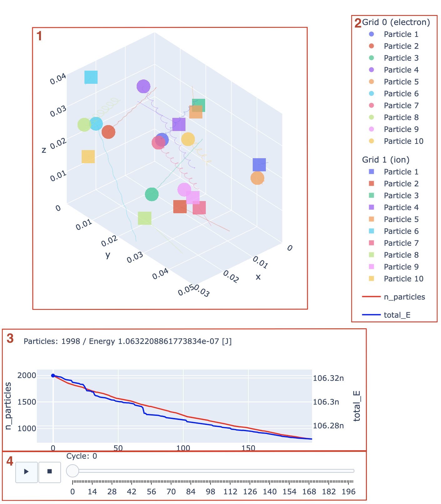

# PLEXsim

Plasma Extensible Simualtion (PLEXsim) 사용 설명입니다.

<br>

목차
- [Execution](#execution)   
- [Config](#config)
  - [YAML](#yaml)
    - [environment](#environment)
    - [grids](#grids)
    - [simulation](#simulation)
  - [HDF-5](#hdf-5)
    - [simulation](#simulation-저장-그룹-구조)
    - [grid](#grid-저장-그룹-구조)

- [Viewer](#viewer)

------

## Execution

#### Usage

```bash
$ run.sh [FILE] [OPTIONS]                # PLEXsim 실행
```

#### File

PLEXsim에 사용 가능한 입력 파일은 `.yaml` 파일과 `.h5` 파일 두 가지가 있습니다.

File | Description
---- | -----------
**.yaml** | 설정값을 지정해 시뮬레이션을 처음부터 진행합니다.
**.h5** | 시뮬레이션 기록을 저장하고 있는 파일로부터 설정값을 불러와 시뮬레이션을 이어서 진행합니다.

두 입력 파일 구조에 대한 설명은 [Config](#config)에 있습니다.


#### Options

실행 시 선택할 수 있는 옵션은 다음과 같습니다.

- `--ui`
  - 시뮬레이션 진행 상황을 [rich](https://github.com/Textualize/rich)를 통해 그림과 같이 보여줍니다. 옵션을 끄지 않을 시 디폴트로 선택됩니다.
  <p align='center'></img></p>
  
- `--no-ui`
  - `--ui` 옵션을 끕니다.

- `--cycle CYCLE`
  - 시뮬레이션 timestep 수를 지정합니다. `.h5` 파일을 입력으로 실행하는 경우에만 유효합니다. 지정하지 않을 시 `/settings`에 저장된 값으로 선택됩니다

- `--version`
  - `PLEXsim` 버전을 출력합니다.

------

## Config

시뮬레이션 실행 시 입력으로 사용되는 [`.yaml`](#yaml)과 [`.h5`](#hdf-5) 두 파일 구조에 대한 설명입니다.

### YAML

`YAML` 파일에서 [`envirionment`](#environment), [`grids`](#grids), [`simulation`](#simulation) 세 가지 옵션을 지정할 수 있습니다.

#### Environment
```yaml
environment:
  coordinate_system: cartesian
  grid_shape: [220, 200, 1]
  cell_size: [1.e-2, 1.e-2, 1.e-2]
  external_magnetic_field: [0, 0, 2.e-2]
  external_electric_field: [2.e+4, 0, 0]
  field_dtype: fp64
```
- **coordinate_system**: _'cartesian'_
  - 좌표계를 설정합니다. _'cylindrical'_ 업데이트 예정
- **grid_shape**: _list_
  - 전체 격자 `grid`의 크기를 지정합니다. 단위 격자 `cell`의 x, y, z축 방향 개수를 리스트로 받습니다.
- **cell_size**: _list_
  - 단위 격자의 x, y, z축 방향 길이[m]를 지정합니다.
- **external_magnetic_field**: _list or str_
  - 초기 외부 자기장을 설정합니다.
    - _list_: x, y, z 방향의 자기장 [T]을 지정합니다. 모든 격자점(node)에 같은 크기로 할당됩니다.
    - _str_: 각 격자점의 자기장 정보를 담고 있는 `.npy` 파일의 경로를 지정합니다. `.npy` 파일에 저장된 배열의 크기는 `(x축 방향 cell 수 + 1, y축 방향 cell 수 + 1, z축 방향 cell 수 + 1, 3)`과 같아야 합니다. (마지막의 3은 x, y, z축을 의미)
- **external_electric_field**: _list or str_
  - 초기 외부 전기장 [V/m]을 설정합니다. 입력 형식은 `external_magnetic_field`와 같습니다.
- **field_dtype**: _{'fp32', 'fp64'}_
  - 전기장과 자기장 배열의 부동 소수점 형식을 지정합니다. 32비트 단일 정밀도 형식과 64비트 이중 정밀도 형식 중 선택할 수 있습니다.


#### Grids

```yaml
grids:
  -
    species: electron
    backend: gpu
    n_splits: [2, 1, 1]
    n_computational_to_physical: 1.e+3
    dtype:
      X: fp32
      U: fp32
    initial_condition:
      sample: random
      n_particles: 2.5e+8
      avg_velocity: 3.e+6
      tracking:
        n_particles: 10
        sample: random

  -
    species: ion
    backend: gpu
    n_splits: [2, 1, 1]
    n_computational_to_physical: 1.e+3
    dtype:
      X: fp32
      U: fp32
    initial_condition:
      sample: random
      n_particles: 2.5e+8
      avg_velocity: 1.e+6
      tracking:
        n_particles: 10
        sample: random
```
각 입자에 대한 설정을 목록(`-`)으로 나누어 지정합니다. 각 입자는 하나의 `SuperSetGrid`를 만들어냅니다. 목록의 요소를 추가하거나 제거하여 몇 종류의 입자를 포함할지 선택할 수 있습니다.
- **species**: _{'electron', 'ion'}_
  - _'ion'_ 의 경우 현재는 양성자의 전하량과 질량으로 설정되며, 추후 전하량과 질량을 선택할 수 있도록 업데이트 예정입니다.
- **backend**: _{'cpu', 'gpu'}_
- **n_splits**: _list, optional._
  - 전체 `SuperSetGrid`를 x, y, z축을 따라 몇 개의 `SubSetGrid`로 나눌지 지정합니다. `SubSetGrid`는 MPI 환경에서 병렬화를 위한 기준으로, `Particel Mover`, `Moment Gathering` 등에서 입자에 관한 연산의 단위가 됩니다. 지정하지 않을 경우, [1, 1, 1]로 설정됩니다.
- **n_computational_to_physical**: _int_
- **dtype**: _{'fp32', 'fp64'}_
  - 입자 위치(X) 및 속도(U) 배열의 부동 소수점 형식을 지정합니다.
- **initial_condition**
  - **sample**: _'random'_
    - `grid`상에 입자의 초기 위치를 랜덤하게 설정합니다. _'normal'_ 업데이트 예정입니다.
  - **n_particles**: _int_
    - 초기 입자의 수를 지정합니다.
  - **avg_velocity**: _float_
    - 입자의 초기 평균 속력을 지정합니다. 각 입자의 속력은 정규분포를 따르도록 랜덤하게 설정됩니다(normally distributed random numbers).
  - **tracking**
    - **n_particles**: _int_
      - 궤적을 추적하기 위한 입자의 수를 설정합니다. 추적하고 있는 입자는 [Viewer](#viewer)를 사용하여 궤적을 확인할 수 있습니다.
    - **sample**: _'random', optional._
      - 추적하는 입자를 랜덤하게 선택합니다. 다른 선택 기준 업데이트 예정입니다.

#### Simulation

```yaml
simulation:
  delta_time: 1.e-11
  n_cycles: 40

  backend: mpi
  particles_spare_memory: 0.5

  filepath: ./test.h5
  checkpoint_strategy:
    save_particles_frequency: 40
    save_field_frequency: 1
    save_tracked_frequency: 1

```
- **delta_time**: _float_
  - 각 cycle의 시간 간격(s)을 지정합니다.
- **n_cycles**: _int_
  - 시뮬레이션 cycle 수를 지정합니다.

- **backend**: _{'mpi', 'local'}_
  - 백엔드 종류를 선택합니다. _'mpi'_ 는 여러 프로세스, _'local'_ 은 단일 프로세스를 발생시킵니다.
- **particles_spare_memory**: _float_
  - 입자 위치와 속도를 담고 있는 배열의 여유공간의 크기를 지정합니다. 초기 입자 수에 대한 비율로 설정되며, 이를 너무 작게 설정하여 주변 `SubSetGrid`로 이동하는 입자 수가 남은 여유 공간의 크기보다 많을 경우 시뮬레이션이 중단됩니다.

- **filepath**: _str_
  - `.h5` 파일의 저장 경로를 지정합니다.
- **checkpoint_strategy**
  - 저장 옵션을 지정합니다.
  - **save_particles_frequency**: _int_
    - 전체 입자의 위치와 속도를 몇 cycle마다 저장할지 설정합니다.
  - **save_field_frequency**: _int_
    - 전기장과 자기장을 몇 cycle마다 저장할지 설정합니다.
  - **save_tracked_frequency**: _int_
    - 추적하고 있는 입자의 정보를 몇 cycle마다 저장할지 설정합니다.


### HDF-5
`HDF-5` 파일은 시뮬레이션 결과 정보를 저장하고 있습니다. 각각의 `SuperSetGrid`가 하나의 [`HDF-5`](#grid-저장-그룹-구조) 파일을 만들고, 이를 총괄하는 Simulation [`HDF-5`](#simulation-저장-그룹-구조) 파일이 하나 있습니다.

#### Simulation 저장 그룹 구조
(e.g. `proj.h5`)
```
/settings
  /environment
  /grids/{grid_index}
  /simulation
    @delta_time
      ...
/cycles/{cycle}
  /stats
    @n_particles
    @kinetic_E
    @field_E
    @total_E
  /field
    B
    E
  /grids/{grid_index}
    @tracking_particles
    X  # might be virtual datatset to Grid
    U  # might be virtual datatset to Grid
    /tracked
      @tracking_ids
      X
      U
```
`.yaml` 파일을 이용해 시뮬레이션을 처음 실행 시 `/settings` 그룹을 갖는 `.h5` 파일이 만들어집니다. 매 cycle이 진행될 때마다, `/cycles/{cycle}` 그룹이 생성되며 `.yaml` 파일에서 설정한 주기마다 하위 그룹으로 `/stats`, `/field`, `/grids` 그룹이 생성됩니다.   
   
`.h5` 파일을 읽어 시뮬레이션을 이어서 실행 시 `/settings`의 값을 읽어 환경을 load합니다. `/cycles`의 마지막 cycle에 저장된 field 및 입자 정보를 load하여 실행됩니다. 마지막 cycle 이후부터 이어서 값을 저장합니다.

- **/stats**: 매 cycle마다 저장되는 값으로 입자 수, 입자의 운동 에너지 총량 및 전/자기장에 의한 필드 에너지 합을 포함합니다.
- **/field**: `save_field_frequency`에서 지정한 주기마다 각 격자점의 전기장, 자기장 값을 `E`, `B` 데이터셋에 저장합니다.
- **/grids/{grid_index}**: 입자의 위치와 속도를 저장합니다.
  - `save_particles_frequency`마다 `X`, `U` 데이터셋에 각각 전체 입자의 위치 및 속도를 저장하며, `@tracking_particles`에 추적하고 있는 입자의 `SubSetGrid` 배열 내 인덱스와 `SuperSetGrid` 내 global_id를 key:value로 저장합니다.
  - `X`와 `U` 배열은 각 `grid` 저장 파일(e.g. `proj.g0.h5`) 내의 데이터셋을 가리키고 있는 virtual dataset입니다. 데이터를 확인하기 위해서는 `grid` 저장 파일이 같은 위치에 있어야 합니다.
  - `save_tracked_frequency`마다 추적하고 있는 입자의 위치, 속도를 `/tracked`그룹 내에 생성합니다. `tracking_ids`는 추적하고 있는 입자의 `SuperSetGrid` 내 global_id 입니다.

#### Grid 저장 그룹 구조
(e.g. `proj.g0.h5`)
```
/settings
  @species
  @backend
    ...
/cycles/{cycle}
  @tracking_particles
  X
  U
  /tracked
    @tracking_ids
    X
    U
```
각 입자의 위치 및 속도 정보를 실제로 저장하고 있는 파일입니다.

------

## Viewer

PLEXsim 시뮬레이션 결과 생성된 `.h5`파일을 읽어 다음과 같이 시각화합니다. 시간에 따른 입자의 궤적과 수, 에너지 변화를 확인할 수 있습니다. 


#### Analyze

Viewer에서 제공되는 기능은 다음과 같습니다.

- 추적중인 입자의 이동 경로 시각화<span style="color:red">(1)</span>
  - 마우스를 이용해 확대, 시점 변경 등 가능
  - 오른쪽 범례<span style="color:red">(2)</span>를 클릭해 on/off 변경
- Cycle에 따른 전체 입자 수 및 에너지 변화량 시각화<span style="color:red">(3)</span>
- Slider<span style="color:red">(4)</span>를 이용한 animation 기능


#### Install

1. Anaconda 설치
[Anaconda 홈페이지](https://www.anaconda.com/)에서 아나콘다 설치 툴을 다운받아 설치합니다.   
(참고: https://benn.tistory.com/26)
<br>

2. 가상환경 설정
터미널에서 가상환경을 설정합니다.
(참고: https://gogoma.tistory.com/52)
```bash
$ conda create -n (가상환경 이름) python=3.9.12     # 가상환경 생성

$ conda activate (가상환경 이름)                    # 가상환경 활성화

$ conda install jupyter plotly h5py              # 라이브러리 설치
```

3. 주피터 랩 실행
(참고: https://planharry.tistory.com/22)
```bash
jupyter lab                                      # Jupyter lab 실행
```

4. Viewer 실행
`/notebooks/Viewer.ipynb` 노트북 파일을 엽니다.   
파일 경로를 시뮬레이션 결과파일(.h5)의 경로로 바꿔주고, 실행합니다
```python
from view import H5Viewer

snap = H5Viewer('(결과 파일).h5')
snap
```
흰 배경만 나타난다면 브라우저를 새로고침해 보세요. 정상적으로 실행된 경우 위와 같은 [figure](#viewer)가 생성됩니다.
